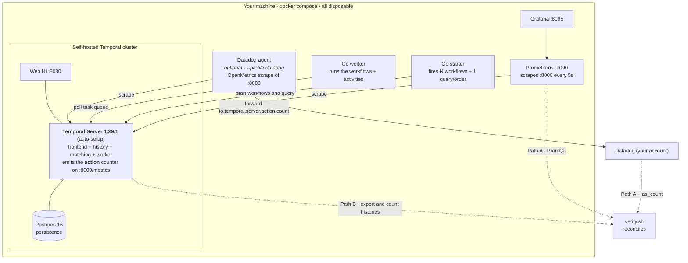
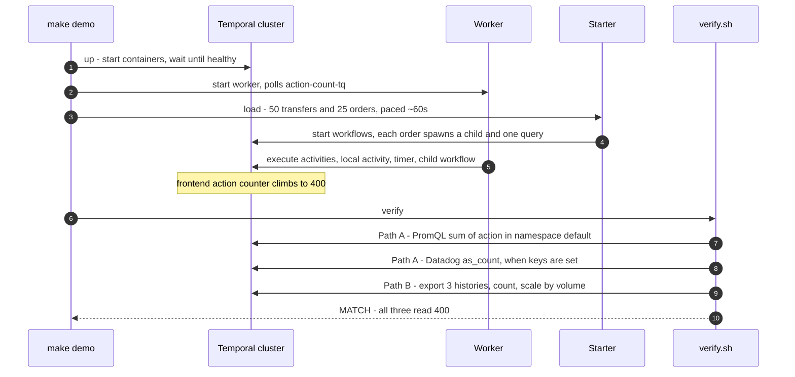

# Prove it works — disposable validation harness

Spins up a throwaway self-hosted Temporal cluster, runs a **known** workload, and shows
**Path A (metric) and Path B (histories) landing on the same Action count**. Use it to
convince yourself the method is sound before quoting a figure.

## What it stands up

Everything runs locally under `docker compose` and is thrown away with `make down` — a
real self-hosted Temporal Server (not a mock), scraped by Prometheus and, optionally,
Datadog. `verify.sh` then reads the **same** Action count three independent ways and
checks they agree.



## What `make demo` does



## One command

```bash
make demo
```

Brings up the cluster, paces the workload over ~60s (so APS is measurable), and prints
the reconciliation plus the APS shape:

```
Path A  (server metric, raw counter) = 400
Path B  per-run: MoneyTransfer=3 OrderFulfillment=7 ReserveInventory=3
Path B  scaled  (3·50 + 7·25 + 3·25) = 400
MATCH ✅  Path A 400 vs Path B 400
APS over the run: mean=6.56/s (400 actions / 61s) -> monthly = mean x 2,592,000
                  peak=6.48/s (rate[1m]; a shorter window surfaces higher bursts)
```

Tear it down with `make down`.

> **Why the run is paced.** `rate()`/APS only mean something under sustained load — a
> single burst reads ~0 because nothing rises across a scrape window (the same effect as
> [gotcha A1](../docs/gotchas.md#a1)). `SPREAD` (default 60s) spreads the starts so APS is
> real; it doesn't change the total (still 400).
>
> **Mean vs peak.** Mean is computed exactly as Δcounter ÷ duration (what the monthly
> projection wants), not by averaging `rate()` — which would under-report on a short run.
> Peak comes from `rate([1m])`, the recipe's canonical APS window; it's window-sensitive,
> so tighter windows (e.g. `[15s]`) reveal higher instantaneous bursts. Under this
> uniform synthetic load mean ≈ peak by design.

## Prereqs
Docker · Go · [`uv`](https://docs.astral.sh/uv/) · the `temporal` CLI.

## What's inside

| Path | What |
|---|---|
| `cluster/` | docker-compose: Temporal **1.29.1** + Postgres + Web UI + Prometheus + Grafana, with the `action` metric exposed on `:8000` (+ an optional Datadog agent, see below) |
| `moneytransfer/` | `MoneyTransfer` saga (withdraw → deposit) — 3 Actions/run |
| `orderfulfillment/` | `OrderFulfillment` parent (validate → **child** → **local activity** → **timer** → confirm) — 7 Actions/run, spawns a 3-Action `ReserveInventory` child |
| `worker/`, `starter/` | register the workflows; fire *N* of each and issue one Query per order |
| `histories/` | sample exports (regenerated by `make demo`) |

The workload is deliberately hand-countable so the totals are verifiable. It exercises
every tricky case the recipe claims to handle: **child (2×)**, **local activity
(collapsed)**, **timer**, and **Queries** (billable but absent from history).

> **Why synthetic workflows?** These are intentionally hand-countable so the totals are
> verifiable — that's what makes the closure test (`Path A == Path B == a known number`)
> meaningful. Don't swap in a real demo app to make it "more realistic": variable /
> non-deterministic Action counts would break the exact reconciliation, which is the
> whole point of this harness.

## Targets

| `make …` | does |
|---|---|
| `up` | start the cluster, wait until healthy |
| `load` | build + run worker, fire the paced workload (`TRANSFERS=50 ORDERS=25 SPREAD=60` overridable) |
| `verify` | reconcile Path A vs Path B, and report mean/peak APS over the run |
| `demo` | `up` → `load` → `verify` |
| `down` | stop and remove the cluster (and volumes) |
| `clean` | `down` + remove build artifacts and generated files |

## Datadog lane (optional)

By default the harness proves **Path A via Prometheus**. If you have a Datadog account it
can also reconcile **Path A via Datadog** — the real query, not a printout — because both
read the *same* frontend `action` counter. Export your keys and run as normal:

```bash
export DD_API_KEY=<api-key>      # starts the agent; ships the counter to Datadog
export DD_APP_KEY=<app-key>      # lets verify query Datadog back
export DD_SITE=datadoghq.com     # or datadoghq.eu, us5.datadoghq.com, …
make demo
```

With `DD_API_KEY` set, `make up` also starts a Datadog agent that OpenMetrics-scrapes the
existing `:8000` endpoint and forwards `action` as `io.temporal.server.action.count`
(tagged `server-name:harness`). `make verify` then queries Datadog's API over the run
window and reconciles `.as_count()` against the same known total:

```
Path A via Datadog  (.as_count()) = 400   [sum:io.temporal.server.action.count{server-name:harness}.as_count()]
MATCH ✅  Datadog 400 vs Path B 400
```

Without keys, nothing changes — `verify` just prints the equivalent Datadog query next to
the Prometheus one so the Datadog form is always visible. Ingest lag means the Datadog read
can take up to ~90s; `verify` polls until the metric lands. Overrides: `DD_SERVER_NAME`
(tag value, default `harness`) and `DD_METRIC` (default `io.temporal.server.action.count`,
in case your agent normalizes the counter suffix differently).

## Endpoints (while up)
Web UI http://localhost:8080 · Prometheus http://localhost:9090 · Grafana http://localhost:8085 · metrics http://localhost:8000/metrics
